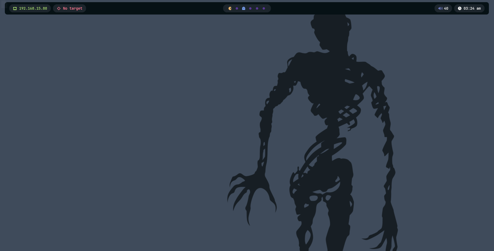
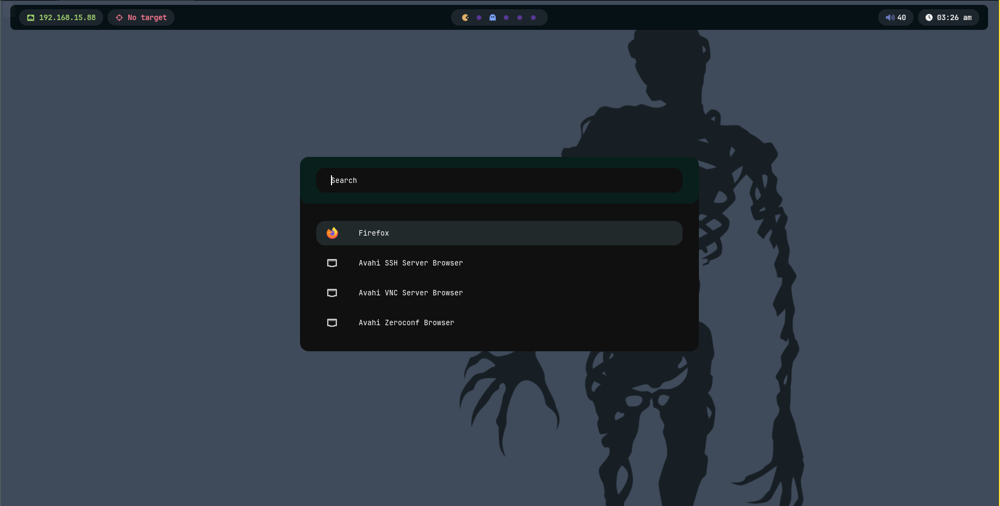
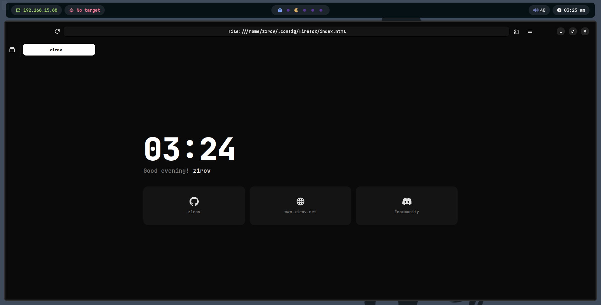

# z1rov's BSPWM Rice

<div align = center>



&ensp;[<kbd> <br> Install <br> </kbd>](#-installation)&ensp;
&ensp;[<kbd> <br> Features <br> </kbd>](#-features)&ensp;
&ensp;[<kbd> <br> Screenshots <br> </kbd>](#-screenshots)&ensp;
&ensp;[<kbd> <br> Keybindings <br> </kbd>](#very-useful-keybindings-to-know)&ensp;
&ensp;[<kbd> <br> Installer in Action <br> </kbd>](#-installer-in-action)&ensp;
<br><br><br></div>

https://github.com/user-attachments/assets/cc516abf-3110-4844-ba96-3ad0448fd69f

<br>

## 👤 Welcome

Welcome to my dotfiles. I'm z1rov.

This repo is a **BSPWM** environment built for pentesting, development and daily use, wrapped in a single bash `installer` that takes a bare Arch Linux box and turns it into a fully configured machine — window manager, theme, shell, Docker, security tooling and a dedicated Firefox profile, all with one command.

Unlike a plain dotfiles dump, the installer is scripted end-to-end: it configures `sudo`, deploys every config file, sets up services, and ships a `diagnose` command so you can verify the whole environment landed correctly.

<br>

## 🚀 Features

#### One command, full environment

`installer setup` runs the entire installation unattended (after a single confirmation prompt): Xorg + BSPWM, the theme, Zsh, Docker, Burp Suite, and every dotfile in this repo. Everything is logged to `/tmp`, and errors are collected and summarized at the end instead of stopping the run.

#### Modular subcommands

Past the initial setup, every piece of the environment can be triggered independently:

- `installer blackarch` — adds the BlackArch repository
- `installer bloodhound` — deploys BloodHound CE via Docker Compose, health-checks it on `localhost:8080`, then tears it down and prints the command to bring it back
- `installer vmware` — detects a VMware guest and configures `open-vm-tools` + `vmware-user` in `bspwmrc`
- `installer ssh` — generates RSA + ED25519 keypairs, with or without passphrase
- `installer firefox` — pins a dedicated, wiped Firefox profile and loads a custom `userChrome`/`userContent`/homepage
- `installer kon` — clones and builds [kon](https://github.com/z1rov/kon)
- `installer diagnose` — checks that every binary, config, and service is actually in place

#### Consistent theming

Every install gets the same handcrafted look: **Nordic** GTK theme, **Papirus-Dark** with blue folders, and the **Bibata-Modern-Ice** cursor — applied automatically to GTK, `Xresources`, and the icon theme, with each step verified after install rather than assumed.

#### Self-deploying installer

The script copies itself to `/usr/bin/installer` on first run, so after `setup` you can call `installer <command>` from anywhere on the system — no need to keep the repo around.

#### Built-in diagnostics

`installer diagnose` checks every binary (`bspwm`, `sxhkd`, `picom`, `polybar`, `docker`, `yay`...), every service (`ly`), and every config file the installer is supposed to have deployed, and tells you exactly what's missing and what to run to fix it.

#### Dedicated pentesting setup

BlackArch repo, Burp Suite with a pre-patched launcher (no more broken Java/Swing rendering), BloodHound CE via Docker, an HTB VPN launcher bound to `super + 9`, and `kon` — all one command away.

<br>

## 📸 Screenshots

<table>
<tr>
<td align="center"><b>Desktop (BSPWM)</b></td>
<td align="center"><b>Rofi (<code>super + d</code>)</b></td>
</tr>
<tr>
<td></td>
<td></td>
</tr>
</table>

<div align="center">

**Firefox — custom profile & theme**



</div>

---

## Very useful keybindings to know...

| Keys | Action |
| :-------------------: | :---------------------------------------------------------------: |
| `super` + `x` | Close window |
| `super` + `Enter`<br>`super` + `alt` + `Enter` | Open a terminal<br>Open a floating terminal |
| `super` + `d` | Apps menu (Rofi) |
| `super` + `r` | Open RiceEditor |
| `super` + `{1-6}`<br>`super` + `shift` + `{1-6}` | Focus desktop 1-6<br>Move window to desktop 1-6 |
| `super` + `{Left,Right}` | Previous / next desktop |
| `super` + `f` | Next desktop layout |
| `super` + `alt` + `r` | Restart BSPWM |
| `super` + `Escape` | Reload sxhkd |
| `super` + `s`<br>`super` + `shift` + `s` | Fullscreen screenshot → clipboard<br>Selectable screenshot → clipboard |
| `super` + `8` | Terminal running `kon start` |
| `super` + `9` | Floating terminal for HTB VPN |
| `alt` + `{Left,Right,Up,Down}` | Resize focused window |
| `super` + `ctrl` + `{h,v,q}` | Preselect split (east / south / cancel) |
| `super` + `ctrl` + `{h,l}` | Adjust parent container ratio |
| `super` + `ctrl` + `x` | Close every node on the current desktop |
| `ctrl` + `alt` + `Tab` | Rotate current node 90° / -90° |
| `XF86MonBrightness{Up,Down}` | Brightness |
| `XF86Audio{RaiseVolume,LowerVolume,Mute}` | Volume |
| `XF86Audio{Play,Next,Prev,Stop}` | Media playback control |
| `XF86AudioMicMute` | Toggle mic mute |
| `XF86WLAN` / `XF86Bluetooth` | Toggle WiFi / Bluetooth |
| `ctrl` + `super` + `alt` + `p`<br>`ctrl` + `super` + `alt` + `r`<br>`ctrl` + `super` + `alt` + `q` | Power off<br>Reboot<br>Quit BSPWM |
| `ctrl` + `super` + `alt` + `l`<br>`ctrl` + `super` + `alt` + `k`<br>`ctrl` + `super` + `alt` + `s` | Lock screen<br>`xkill`<br>Soft reload |

And more... check `config/sxhkd/sxhkdrc` for the full list.

---

> [!IMPORTANT]
> ✏️✏️✏️ The installer assumes you already have a **functional** Arch Linux installation, whether freshly installed or existing.
>
> A login manager is installed and configured automatically (**ly**) — if you already run another one (gdm, sddm, lightdm, lxdm), the installer detects it and skips activating `ly` to avoid conflicts.
>
> If you're running this in a VM, run `installer vmware` afterward and make sure hardware acceleration is enabled in your hypervisor. ✏️✏️✏️

> [!WARNING]
> :wrench::wrench::wrench: This has been tested mainly on Arch VMs and a couple of bare-metal machines. Some steps (Picom backend, VSync, kernel modules for Docker networking) may need tweaking for your specific hardware.
>
> `installer firefox` **wipes every Firefox profile except the dedicated one it creates** — it asks for confirmation first, but back up anything you care about before running it. :wrench::wrench::wrench:

---

## 💾 Installation

> [!NOTE]
> The installer only works on **Arch Linux** and systemd-based derivatives. **Do not run it as root.**

Before running it, feel free to open [`installer`](installer) and read through it — it's a single bash file, nothing hidden.

```sh
# Clone the repo
git clone https://github.com/z1rov/dotfiles
cd dotfiles

# Give it execution permission
chmod +x installer

# Run the full setup
./installer setup
```

After `setup` finishes, the installer is deployed globally — run it as `installer <command>` from anywhere. Every other subcommand (`blackarch`, `bloodhound`, `vmware`, `ssh`, `firefox`, `kon`, `diagnose`) is independent and can be run any time after that.

<br>

## 🎥 Installer in Action

Short recordings of each command actually running:

<table>
<tr>
<td align="center">

[](https://youtu.be/BnmdFKncovM)
<br><b>installer setup</b>

</td>
<td align="center">

[](https://youtu.be/YP1au9xdYqU)
<br><b>installer firefox</b>

</td>
</tr>
<tr>
<td align="center">

[](https://youtu.be/5UjMK6W3HZ4)
<br><b>installer ssh</b>

</td>
<td align="center">

[](https://youtu.be/ntuKBaN2LKk)
<br><b>installer vmware</b>

</td>
</tr>
<tr>
<td align="center">

[](https://youtu.be/91UG-PriC3k)
<br><b>installer blackarch</b>

</td>
<td align="center">

[](https://youtu.be/HCu5NXfbrqo)
<br><b>installer bloodhound</b>

</td>
</tr>
</table>

<br>

## 📂 Repo Structure

```
.
├── bin/            # custom scripts (volume, brightness, VPN, polybar helpers, etc.)
├── config/         # bspwm, sxhkd, kitty, rofi, polybar, picom, dunst, firefox, gtk-3.0...
├── home/           # user-level files deployed to $HOME
├── media/          # screenshots and presentation video
├── installer       # main installer script
└── README.md
```

---

<div align="center">

Made by **z1rov** — [zirov.net](https://www.zirov.net)

</div>
